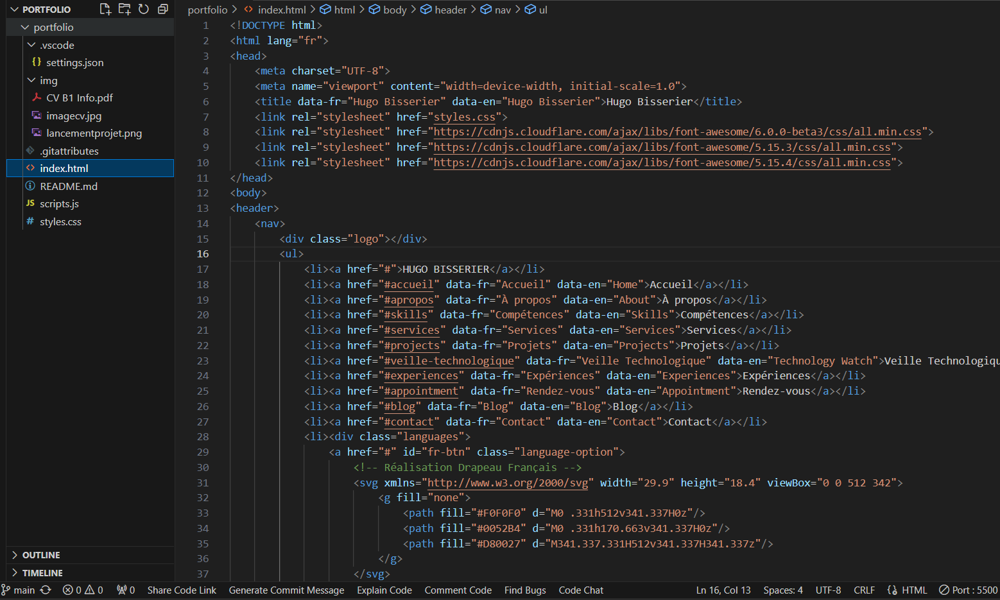

# portfolio
 
# Portfolio de Hugo Bisserier

Bienvenue sur mon portfolio personnel ! Ce projet présente mes compétences, mes expériences et mes réalisations dans le domaine du développement web. Il a été conçu pour offrir aux visiteurs un aperçu détaillé de mon travail, incluant à la fois mes capacités techniques et mon approche des différents défis.

## Comment visualiser le projet

Pour profiter pleinement de ce portfolio, je recommande de le visualiser en utilisant l'extension Live Server dans Visual Studio Code. Cela garantit que toutes les fonctionnalités fonctionnent parfaitement et que vous profitez de l'expérience telle qu'elle a été conçue.

### Prérequis

1. **Visual Studio Code** : Assurez-vous d'avoir [Visual Studio Code](https://code.visualstudio.com/) installé sur votre machine.

2. **Extension Live Server** : Installez l'extension Live Server dans Visual Studio Code. Si vous ne l'avez pas encore installée, suivez ces étapes :

   - Ouvrez Visual Studio Code.
   - Accédez à la vue des Extensions en cliquant sur l'icône en forme de carré dans la barre latérale ou en appuyant sur `Ctrl+Shift+X`.
   - Dans la barre de recherche, tapez `Live Server`.
   - Cliquez sur le bouton "Installer" à côté de l'extension Live Server par Ritwick Dey.

    = Extension le plus simple et important pour que ca fonctionne

    = Séléctionner le fichier index.html puis lancer le serveur en bas à droite pour acceder au projet

### Lancement du projet

1. Clonez ou téléchargez les fichiers du projet sur votre machine.

2. Ouvrez le dossier du projet (`portfolio`) dans Visual Studio Code.

3. Faites un clic droit sur le fichier `index.html` dans la barre latérale de l'Explorateur et sélectionnez "Open with Live Server".

4. Votre navigateur par défaut devrait automatiquement ouvrir le projet. Si ce n'est pas le cas, vous pouvez manuellement naviguer à l'adresse `http://127.0.0.1:5500/index.html` (ou l'URL localhost appropriée indiquée dans votre terminal).

## Aperçu du projet

Ce portfolio a été créé pour mettre en avant mon parcours dans le développement web et la cybersécurité. Il inclut :

- **À propos de moi** : Une brève introduction à mon parcours, mes intérêts et mes objectifs professionnels.
- **Projets** : Un aperçu de certains projets sur lesquels j'ai travaillé, avec des détails sur les technologies utilisées et les défis rencontrés.
- **Compétences** : Un résumé des compétences techniques que j'ai acquises, classées par développement front-end, back-end et autres outils pertinents.
- **Blog** : Des articles qui documentent mon processus d'apprentissage, y compris les principaux enseignements tirés de divers projets et technologies.
- **Contact** : Informations sur la façon de me joindre pour des collaborations potentielles ou des questions.

## Recommandations

- **Utilisez Live Server** : Pour une meilleure expérience, visualisez le portfolio en utilisant l'extension Live Server comme décrit ci-dessus.
- **Explorez le code** : N'hésitez pas à explorer les fichiers HTML, CSS et JavaScript du projet pour voir comment tout est construit.

## Contact

Si vous avez des questions ou souhaitez entrer en contact, n'hésitez pas à m'écrire à [hugo.bisserier@ynov.com](mailto:hugo.bisserier@ynov.com).

Merci d'avoir pris le temps de consulter mon portfolio !
